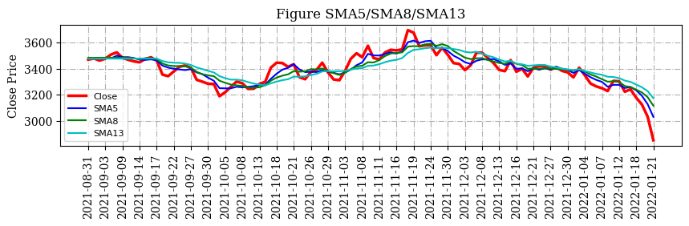
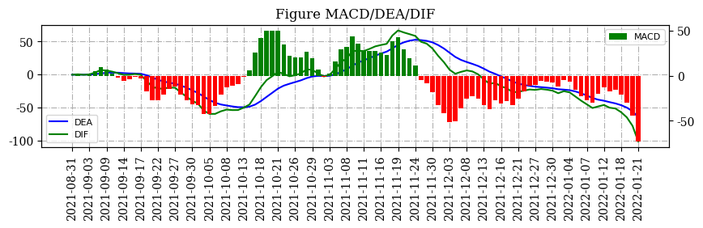
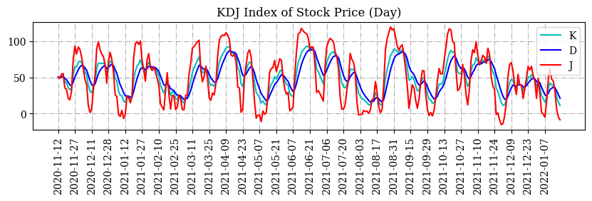
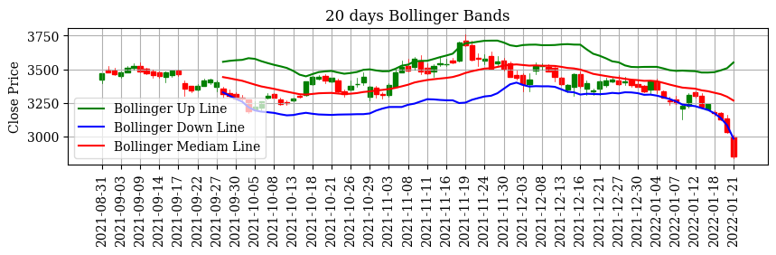
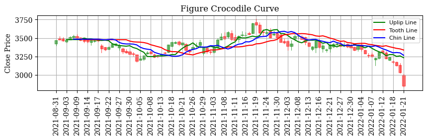
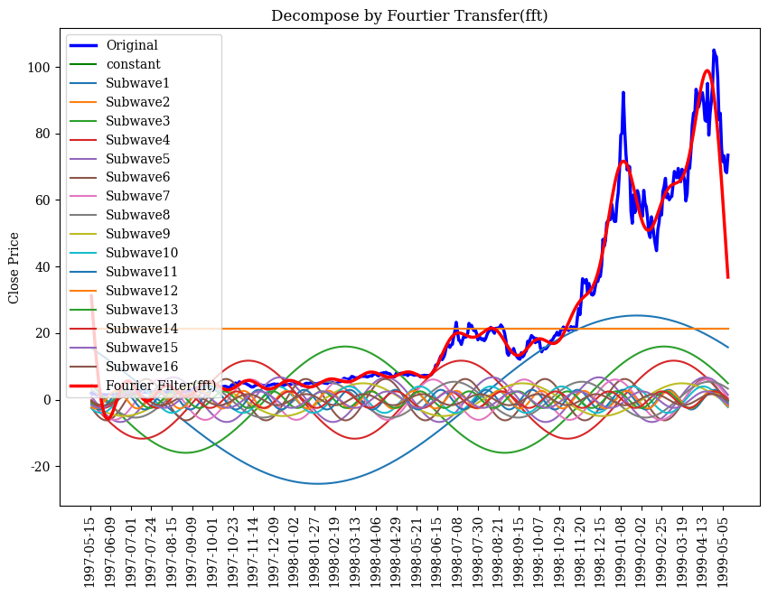
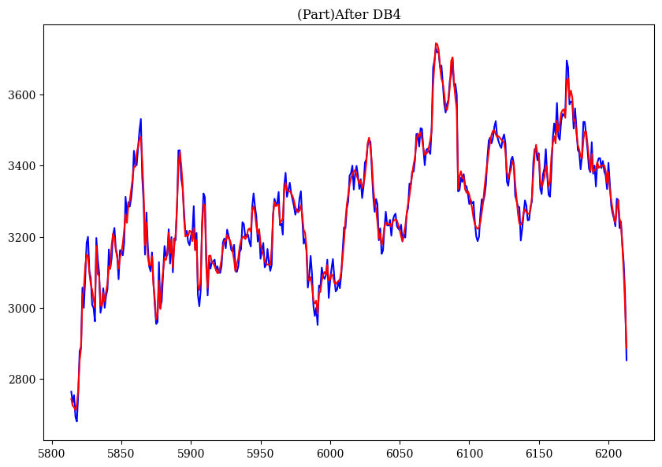
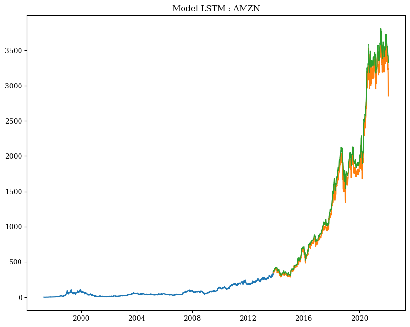
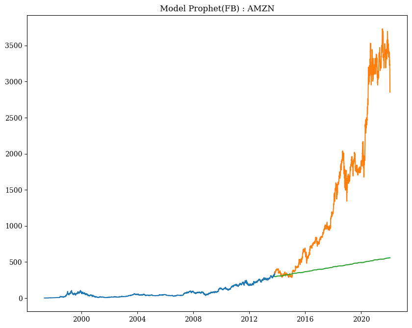

# Stock/ETF Analysis
---
## Analysis Method
#####   Step 1. Collect Data
stockDB.py
read data through yahoo finance API, stored in SQLite, update data until last month
Nasdaq100.py 
collect nasdaq 100 list by web crawler
#####   Step 2. Prepare Data
stockMartrix.py
stock_basic.py
get week/month/year data, define basic indice [SMA,DIF,DEA,MACD,KDJ,Bollinger] and basic calculation & graph methods [Fourtier Filter(fft),Daubechies Wavelet Analysis]
#####   Step 3. Choose Model
#####   Step 4. Train Model
#####   Step 5. Model Evaluation
#####   Step 6. Parameter Adjustment
#####   Step 7. Predict/Dynamic Adjustment

#### Codes of Basic Methods
stock_MA.py
stock_LR.py
stock_KNN.py
stock_ARIMA.py
stock_Daubechies.py
stock_Prophet.py
stock_LSTM.py

Based on my code, easy to draw a graph by only 1 line.
```python
import stockDB as sd
import stockMatrix as sm
da = sd.StockDB()
symbol = 'AMZN'
stockData = da.getStockPrice(symbol)
sm.drawSMA(sm.getCommonSMA(stockData[-100:]))
sm.drawMACD(sm.getMACD(stockData[-100:]))
sm.drawBollinger(stockData[-100:])
sm.drawCrocodile(sm.getCrocodile(sm.getCommonSMA(stockData[-100:])))
sm.drawFft(stockData[:500],5)
```
and you will get (stock_basic.py):







or get the graph of Daubechies Wavelet (dw4) :
(stock_Daubechies.py)



or get the graph of LSTM :
(stock_LSTM.py)


or get the graph of Prophet :
(stock_Prophet.py)

